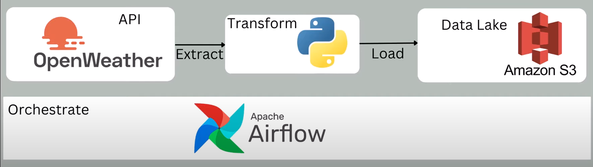

# OpenWeather-DataPipeline-Airflow-AWS

This project consists of an Apache Airflow DAG running on an AWS EC2 instance. The DAG extracts weather data from a public API, processes it by converting temperatures from Kelvin to Fahrenheit, and stores the transformed data as a CSV file in an AWS S3 bucket. The pipeline fetches weather data for a specified city and ensures that the data is consistently transformed and saved in the cloud for further analysis.



## Project Structure

```plaintext
.
├── airflow/
│   ├── weather_dag.py
├── .gitignore
├── LICENSE
├── README.md
└── requirements.txt
```

### `weather_dag.py`

This DAG fetches weather data from a public API, transforms the data, and uploads it to S3. The pipeline consists of three main tasks:

1. **Check if API is Ready**: Verifies that the weather API is available.
2. **Extract Weather Data**: Fetches the weather data from the API.
3. **Transform and Load Data**: Transforms the weather data and uploads it to S3 as a CSV file.

## Prerequisites

1. **AWS Account**: You'll need an AWS account with an S3 bucket.
2. **AWS EC2 Instance**: You should have an EC2 instance running with Apache Airflow installed.
3. **AWS S3** (with read/write permissions)
4. **Python and Required Libraries**: Make sure Python is installed on the EC2 instance along with the required libraries (defined in `requirements.txt`).

## Project Setup

### 1. AWS EC2 Instance

1. **Launch EC2**: Start an EC2 instance (e.g., t2.micro) and ensure you can SSH into it.

2. **Install Apache Airflow**:
   - Ensure you have Python 3 installed.
   - Install Airflow.

3. **Start the Airflow Scheduler and Webserver**:

   ```bash
   airflow scheduler
   airflow webserver --port 8080
   ```

### 2. Configure Environment Variables

You need to set up the following environment variables on your AWS EC2 instance:

- **`AWS_ACCESS_KEY_ID`**: Your AWS access key.
- **`AWS_SECRET_ACCESS_KEY`**: Your AWS secret key.
- **`AWS_SESSION_TOKEN`** (optional): Your AWS session token.
- **`WEATHER_API_KEY`**: The OpenWeatherMap API key.

You can add these environment variables to the `~/.bashrc` or `~/.bash_profile` file on your EC2 instance. To do this, edit the file and add the following lines:

```bash
export AWS_ACCESS_KEY_ID='your_aws_access_key'
export AWS_SECRET_ACCESS_KEY='your_aws_secret_key'
export WEATHER_API_KEY='your_api_key'
```

Then, reload the file with:

```bash
source ~/.bashrc
```

### 3. Configure the HTTP Connection in Airflow

The DAG uses an HTTP connection to connect to the OpenWeatherMap API. To configure it in Airflow:

1. Access the Airflow UI (`http://<ec2-public-ip>:8080`).
2. Go to **Admin > Connections**.
3. Click **+** to add a new connection.
4. Fill in the form with the following details:
   - **Conn Id**: `weathermap_api`
   - **Conn Type**: `HTTP`
   - **Host**: `https://api.openweathermap.org`

### 4. Configure Apache Airflow on AWS EC2

1. **Install Airflow** on your EC2 instance if it is not already installed.

2. **Configure Airflow**. Create an `airflow.cfg` file if it doesn’t exist and set up the `dags` directory appropriately.

3. **Start the Airflow Scheduler and Webserver**:

   ```bash
   airflow scheduler
   airflow webserver --port 8080
   ```

4. **Ensure necessary ports are open** in your EC2 instance's security group to allow access to the Airflow web UI (port 8080 by default).

### 5. Configure S3

This DAG will save CSV files to an **AWS S3** bucket. Ensure your IAM user or EC2 instance role has the necessary permissions to write to this S3 bucket.

### 6. Deploy the DAG

- Place the `weather_dag.py` file in the `dags/` folder of your Airflow home directory (usually `~/airflow/dags/`).
- Your DAG should now be visible in the Airflow UI.

## Running the Pipeline

Once the Airflow DAG is deployed, follow these steps to run the pipeline:

1. Open the Airflow UI.
2. Enable the DAG named `weather_dag`.
3. Trigger the DAG manually or wait for the scheduled interval (daily by default).

## Monitoring and Troubleshooting

Check the logs for any issues during DAG execution:

- Logs for each task are available in the Airflow UI under the "Logs" section of the task instance.

## Additional Notes

- Ensure that your API key is stored securely (e.g., using Airflow connections or environment variables).
- Ensure that you have the correct permissions set up for accessing S3 and other AWS services.

## License

This project is licensed under the MIT License. See the [LICENSE](LICENSE) file for more details.


